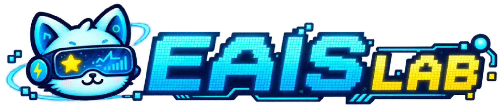

# EAIS LAB brand assets

The EAIS LAB mascot and identity system, used by [eaislab.com](https://eaislab.com).
The original assets in `logos/` remain available for existing consumers.

Open [the asset gallery](eais-lab/index.html) locally to preview all marks and expressions.

## Current identity



| Asset | Original | Web version | Use |
| --- | --- | --- | --- |
| Standard mascot | [PNG](eais-lab/originals/mascot.png) | [WebP](eais-lab/web/mascot.webp) | Home and welcome |
| Horizontal wordmark | [PNG](eais-lab/originals/wordmark.png) | [SVG](eais-lab/web/wordmark.svg) | Header and footer |
| Compact badge | [PNG](eais-lab/originals/badge.png) | [WebP](eais-lab/web/badge.webp) | Large icons and about page |
| 20 expressions | [PNG](eais-lab/originals/mascot-expressions.png) | [WebP sheet](eais-lab/web/mascot-expressions.webp) | Contextual illustrations |
| Browser icon | — | [SVG](eais-lab/web/favicon.svg) | Small cat-head mark |
| Apple touch icon | — | [180px PNG](eais-lab/web/apple-touch-icon.png) | Home-screen icon |

The four supplied originals are preserved unchanged, including their alpha
channels. SVG assets embed raster artwork and frame it without redrawing;
they are **not vector source files**. Each expression SVG is self-contained.

## Expressions

Listed left to right, top to bottom in the original sheet:

| Row | Individual assets |
| --- | --- |
| 1 | [Hello](eais-lab/web/expressions/hello.svg) · [Excited](eais-lab/web/expressions/excited.svg) · [Coding](eais-lab/web/expressions/coding.svg) · [Approve](eais-lab/web/expressions/approve.svg) · [Heart](eais-lab/web/expressions/heart.svg) |
| 2 | [Thinking](eais-lab/web/expressions/thinking.svg) · [Idea](eais-lab/web/expressions/idea.svg) · [Confident](eais-lab/web/expressions/confident.svg) · [Laughing](eais-lab/web/expressions/laughing.svg) · [Sleeping](eais-lab/web/expressions/sleeping.svg) |
| 3 | [Running](eais-lab/web/expressions/running.svg) · [Reading](eais-lab/web/expressions/reading.svg) · [Celebrating](eais-lab/web/expressions/celebrating.svg) · [Presenting](eais-lab/web/expressions/presenting.svg) · [Sad](eais-lab/web/expressions/sad.svg) |
| 4 | [Peeking](eais-lab/web/expressions/peeking.svg) · [Wink](eais-lab/web/expressions/wink.svg) · [Coffee](eais-lab/web/expressions/coffee.svg) · [Waving](eais-lab/web/expressions/waving.svg) · [Back](eais-lab/web/expressions/back.svg) |

## Usage

- Keep a light, uncluttered interface with blue actions; reserve cyan and yellow
  accents for the artwork and occasional highlights.
- Use the horizontal mark for brand locations, not for every textual mention.
- Use the full badge at large sizes; prefer the cat-head favicon for tiny icons.
- Match expressions to meaning: idea for research, coding for projects, reading
  for publications, heart for joining/contact, thinking for a missing page.
- Random decoration belongs in a reserved footer area. Choose coffee, peeking or
  waving once per page load; do not swap expressions during reading.
- Keep aspect ratios, reserve layout space and avoid obstructing content.
- Keep meaningful link text accessible; decorative artwork should be hidden from
  assistive technology. Do not communicate an error solely through an expression.

## Rebuild

Requires Node.js and ImageMagick (`convert`):

```sh
node scripts/build-brand-assets.mjs
```

The script encodes web-sized copies and builds the viewport manifest and standalone
SVGs. The website uses one shared WebP sheet plus
[`expressions.json`](eais-lab/web/expressions.json), avoiding repeated sheet downloads.
